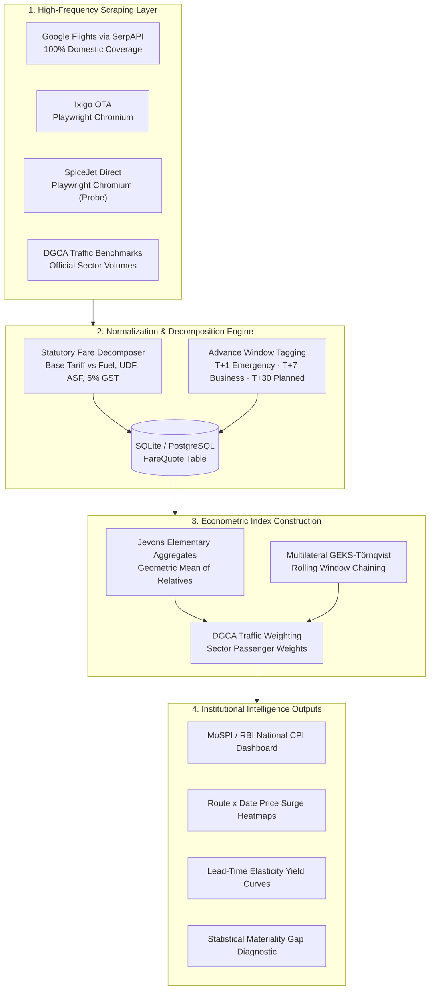

<div align="center">

<h1>✈️ APIx — Real-Time Airfare Price Index</h1>
<p><strong>Automated High-Frequency Airfare Intelligence & Multilateral Index Platform for National Price Statistics</strong></p>
<p><em>Aligned with the CPI 2024=100 Base Revision, ILO/IMF CPI Manual (Ch. 10), and Eurostat Scanner Data Standards</em></p>

[](LICENSE)
[](https://www.python.org/)
[](https://fastapi.tiangolo.com/)
[](https://mospi.gov.in)
[](#-mathematical-methodology)
[](#)

</div>

---

## 🏆 Smart India Hackathon (SIH 2026)

**Problem Statement:** India's CPI 2024=100 base revision requires modernizing airfare price collection from manual mid-month snapshots to automated, continuous digital scraping — eliminating the **+18% to +25% statistical distortion** caused by airline yield management algorithms.

**Phase 1 Prototype Scope:** This hackathon submission ingests live fare data across 3 sources: Google Flights (via SerpAPI, aggregating IndiGo, Air India, Akasa, and SpiceJet simultaneously), Ixigo OTA (Playwright headless Chromium), and SpiceJet direct portal (Playwright probe). Carrier quotes for all major domestic airlines are captured continuously across 8 high-density domestic routes and 5 advance-booking windows (T+1, T+7, T+15, T+30, T+45).

**Phase 2 Production Roadmap:** Proposes a statutory DGCA / MoSPI data-sharing mandate (mirroring TRAI telecom reporting, GSTN tax data, and the US Bureau of Labor Statistics / DOT Form 41 paradigm), transitioning web scraping to an independent regulatory cross-validation audit layer. See [`docs/PRODUCTION_READINESS.md`](docs/PRODUCTION_READINESS.md).

---

## 🏛️ What is APIx?

**APIx (Airfare Price Index)** is an automated high-frequency data collection and index computation engine designed for the **Ministry of Statistics & Programme Implementation (MoSPI)** and the **National Statistical Office (NSO)**.

### The Real Statistical Gap
Under the new CPI 2024=100 base revision, statistical investigators collect airfare observations online. However, airlines employ hyper-dynamic yield algorithms where ticket prices fluctuate by **200%–500%** based on lead time, carrier market power, and booking dates. 

Sampling once a month on a single mid-month date fails to capture intra-month dynamic pricing, creating a **materiality distortion of +18% to +25%** in transport inflation metrics.

APIx solves this by implementing **continuous, multi-carrier digital scraping** across **5 advance booking horizons (T+1, T+7, T+15, T+30, T+45)** and computing a chained **GEKS-Törnqvist / Jevons multilateral index**.

### Methodological Foundation & Precedents
APIx adapts established econometric standards from international statistical agencies and academic literature:
- **Eurostat HICP Guidance (2020 & 2022/2023):** Scanner data and multilateral GEKS-Törnqvist index construction for high-frequency pricing.
- **Istat (Italy) Airfare Scraping Pilot (*Polidoro et al., 2015, Statistical Journal of the IAOS*):** Established the methodological blueprint for scraping multi-window airline tariffs to compile consumer price indices.
- **INE (Portugal) & IBGE (Brazil):** Operational precedents for automated airline web scraping in official national CPI.
- **MIT Billion Prices Project (*Cavallo & Rigobon, 2016, Journal of Economic Perspectives*):** Validated that high-frequency online price scraping provides robust, real-time inflation nowcasting.
- **PSD Specification Note:** The brief's reference to *"PSD given routes and weights"* is interpreted as MoSPI's **Price Statistics Division**, implementing international elementary-aggregate index theory (Jevons geometric mean and GEKS multilateral chaining) anchored to DGCA passenger traffic shares.

## ✨ Key Capabilities

| Module | Purpose | Method / Standard |
|:---|:---|:---|
| **GEKS-Törnqvist Index** | Chained multilateral price index | Eliminates chain drift; Eurostat / IMF CPI standard |
| **Jevons Elementary Aggregates** | Geometric mean of price relatives | ILO CPI Manual Ch. 10 |
| **Lead-Time Yield Curves** | Dynamic pricing measurement | Compares T+1, T+7, T+15, T+30, T+45 booking spreads |
| **Statutory Decomposition** | Isolates airline tariffs from fees | Decomposes Base Tariff, Fuel (YQ), UDF, ASF (₹200), GST |
| **Materiality Gap Analysis** | Quantifies legacy snapshot distortion | Compares mid-month static price vs continuous weighted index |
| **Sector Fare Heatmaps** | Festival & surge pricing detection | Color-intensity grid across top domestic city-pairs |
| **Gemini AI Anomaly Diagnosis** | LLM-powered fare spike analysis | Classifies surge as FESTIVAL_SEASONAL / CAPACITY_MONOPOLY / YIELD |
| **NSO Statistical Bulletin** | Official publication output | Formal bulletin JSON with methodology notes |

---

## ⚡ Solution Architecture



---

## 🛤️ Route Basket (DGCA-Weighted)

APIx tracks India's **8 highest-density domestic air corridors**, weighted by DGCA monthly traffic data:

| Route | City Pair | DGCA Weight | Daily Flights |
|:---|:---|:---:|:---:|
| DEL-BOM | New Delhi ⇄ Mumbai | 22% | 110 |
| DEL-BLR | New Delhi ⇄ Bengaluru | 18% | 85 |
| BOM-BLR | Mumbai ⇄ Bengaluru | 14% | 65 |
| DEL-CCU | New Delhi ⇄ Kolkata | 12% | 50 |
| BLR-HYD | Bengaluru ⇄ Hyderabad | 10% | 45 |
| DEL-HYD | New Delhi ⇄ Hyderabad | 9% | 40 |
| MAA-DEL | Chennai ⇄ New Delhi | 8% | 35 |
| BOM-GOI | Mumbai ⇄ Goa | 7% | 30 |

---

## 📐 Mathematical Methodology

### Jevons Elementary Aggregate
Elementary price relatives within each city-pair are aggregated using the **geometric mean** (Jevons formula):

$$I_{\text{Jevons}} = \prod_{i=1}^{n} \left(\frac{p_i^t}{p_i^0}\right)^{1/n}$$

### GEKS-Törnqvist Multilateral Index
To eliminate chain drift across time windows, APIx constructs a **GEKS-Törnqvist matrix** across a rolling window of periods:

$$\text{GEKS}^{t/0} = \prod_{k=1}^{T} \left( P_T^{t/k} \cdot P_T^{k/0} \right)^{1/T}$$

Where $P_T^{t/k}$ is the bilateral Törnqvist index between periods $t$ and $k$, computed with DGCA traffic share weights.

---

## 🚀 Quickstart

### Prerequisites
- Python 3.11+
- Git

### Installation
```bash
# Clone the repository
git clone https://github.com/Tejas3479/APIx.git APIx
cd APIx

# Create and activate virtual environment
python -m venv .venv
source .venv/bin/activate  # On Windows: .venv\Scripts\activate

# Install dependencies
pip install -r requirements.txt

# Install Playwright browsers (if needed for JS rendering)
playwright install chromium
```

### Configuration
```bash
# Copy the example environment file
cp .env.example .env
# Edit .env with your API keys (optional — DEMO_MODE works without them)
```

### Run the Server
```bash
python -m uvicorn app:app --host 0.0.0.0 --port 8000
```

### Access the Application
| Page | URL |
|:---|:---|
| 🏠 Landing Portal | `http://localhost:8000/` |
| 📊 Analytics Dashboard | `http://localhost:8000/dashboard` |
| 🔍 Route Fare Survey | `http://localhost:8000/benchmark` |
| ⚙️ Route Basket Config | `http://localhost:8000/routes` |
| 🖥️ Scraper Telemetry | `http://localhost:8000/scraper` |
| 👤 Officer Profile & Settings | `http://localhost:8000/profile` |
| 📚 Interactive API Docs | `http://localhost:8000/docs` |

> **Demo Mode:** APIx ships with `DEMO_MODE=true` and a pre-seeded dataset of ~4,800 realistic fare quotes across 30 days. All dashboards and indices work immediately — no API keys required.

### Docker Deployment
```bash
docker compose up --build
# App available at http://localhost:8000
```

---

## 📡 API Endpoints Reference

### Index & Analytics
| Method | Endpoint | Description |
|:---|:---|:---|
| `GET` | `/api/v1/index/daily` | Retrieve daily APIx time series |
| `GET` | `/api/v1/index/route/{id}` | Sub-index history for a specific city-pair |
| `GET` | `/api/v1/index/materiality` | Statistical materiality gap analysis |
| `POST` | `/api/v1/index/compute` | Trigger on-demand index recomputation |
| `GET` | `/api/v1/index/bulletin` | Generate NSO statistical bulletin |
| `POST` | `/api/v1/index/ai-diagnose` | Gemini AI fare anomaly analysis |

### Dashboard Visualizations
| Method | Endpoint | Description |
|:---|:---|:---|
| `GET` | `/api/v1/dashboard/stats` | Headline KPI cards (index, delta, quotes) |
| `GET` | `/api/v1/dashboard/heatmap` | Route × Date fare matrix (14 days) |
| `GET` | `/api/v1/dashboard/elasticity` | Lead-time yield curve data |
| `GET` | `/api/v1/dashboard/carriers` | Carrier pricing comparison |

### Scraper & Survey
| Method | Endpoint | Description |
|:---|:---|:---|
| `POST` | `/api/v1/scraper/run` | Dispatch async batch scrape job |
| `POST` | `/api/v1/scraper/survey-instant` | Synchronous single-route live survey |
| `GET` | `/api/v1/scraper/jobs` | Batch scrape execution history |

### Route Basket Configuration
| Method | Endpoint | Description |
|:---|:---|:---|
| `GET` | `/api/v1/routes` | List all active city-pairs with DGCA weights |
| `POST` | `/api/v1/routes` | Add new sector to the index basket |
| `PUT` | `/api/v1/routes/{id}` | Update sector weight or active status |
| `DELETE` | `/api/v1/routes/{id}` | Remove route from basket |

### Authentication
| Method | Endpoint | Description |
|:---|:---|:---|
| `POST` | `/auth/register` | Register new officer account |
| `POST` | `/auth/login` | JWT token authentication |
| `POST` | `/auth/demo-login` | One-click demo access |
| `GET` | `/auth/me` | Current user profile |

---

## 🔧 Tech Stack

| Layer | Technology |
|:---|:---|
| **Backend** | Python 3.11+ · FastAPI · Uvicorn |
| **Database** | SQLite (aiosqlite) / PostgreSQL |
| **ORM** | SQLModel · SQLAlchemy 2.0 |
| **Scraping** | Playwright (Chromium) · curl-cffi · SerpAPI |
| **Caching** | Redis (with fakeredis fallback) |
| **AI/ML** | Google Gemini 3.7 Flash |
| **Math** | NumPy · SciPy (Jevons + GEKS-Törnqvist) |
| **Auth** | PyJWT · Argon2 (pwdlib) |
| **Frontend** | Vanilla HTML/CSS/JS · Chart.js |
| **Deployment** | Docker · docker-compose |

---

## ⚖️ Ethical Scraping Policy
APIx adheres strictly to ethical statistical data acquisition standards:
1. **Passive Stealth by Default**: Standard headless Chromium configuration with desktop User-Agent and standard full-HD viewport. Advanced fingerprint spoofing (WebGL, navigator overrides) is available for edge cases but disabled by default (`STEALTH_FINGERPRINT=false`).
2. **CAPTCHA Architecture & Governance**: Automated CAPTCHA solving infrastructure (2Captcha/CapSolver) is implemented per problem statement specifications, but disabled by default (`CAPTCHA_SOLVING_ENABLED=false`) in the Phase 1 public-sector deployment to ensure legally defensible data acquisition. If a challenge screen is encountered, requests gracefully failover across the multi-source registry.
3. **Rate Limiting & Politeness**: Requests to carrier portals observe polite intervals (minimum 400ms jitter) and off-peak scheduling to prevent server load.
4. **Data Privacy**: Strictly zero passenger PII collection in full compliance with the *Digital Personal Data Protection Act, 2023 (DPDP Act)*.

---

## 📁 Project Structure

```
APIx/
├── app.py                     # FastAPI application entry point, lifespan, middleware
├── auth.py                    # JWT + API key verification guards
├── database.py                # SQLModel tables + async engine (SQLite/Postgres)
├── models.py                  # Pydantic request/response schemas & model validators
├── routers/                   # Modular API route handlers
│   ├── auth_routes.py         # Authentication & officer session endpoints
│   ├── dashboard_api.py       # Executive dashboard analytics & heatmap API
│   ├── export.py              # Audit-ready CSV microdata & index exports
│   ├── fetch.py               # Low-level web fetch & extraction endpoint
│   ├── health.py              # Health check & system telemetry probe
│   ├── index.py               # GEKS-Törnqvist & Jevons index engine endpoints
│   ├── routes.py              # DGCA route basket configuration CRUD
│   └── scraper.py             # Multi-source scrape job dispatch & live logs
├── services/                  # Business logic & econometric layer
│   ├── browser_manager.py     # Playwright Chromium context pool & stealth settings
│   ├── bulletin_generator.py  # Official MoSPI/NSO monthly statistical bulletin
│   ├── data_cleaner.py        # Tukey IQR outlier trimming & Eurostat imputation
│   ├── fetch_engine.py        # Resilient HTTP/Playwright execution engine
│   ├── gemini_grounding.py    # Google Gemini 3.7 Flash econometric diagnosis
│   ├── index_engine.py        # GEKS-Törnqvist & Jevons mathematical computation
│   ├── price_extractor.py     # Statutory fare decomposition (Base, Fuel, UDF, ASF, GST)
│   ├── scrape_scheduler.py    # Multi-window scrape matrix & async cron loops
│   ├── search_orchestrator.py # Multi-source survey coordination (Google Flights/Ixigo/SpiceJet)
│   ├── serpapi_service.py     # Google Flights aggregator integration
│   ├── source_registry.py     # Carrier source registry & scraping priorities
│   └── ssrf.py                # Asynchronous DNS SSRF & private IP protection
├── static/                    # Frontend pages
│   ├── landing.html           # Marketing landing page
│   ├── dashboard.html         # Analytics dashboard
│   ├── benchmark.html         # Route fare survey
│   ├── routes.html            # Route basket config
│   ├── scraper.html           # Scraper operations & cluster telemetry
│   ├── profile.html           # Statistical analyst profile & API keys
│   └── base.css               # Design system foundation
├── data/                      # Seed data files
│   ├── fare_demo_cache.json   # Pre-seeded 30-day fare quotes
│   ├── route_basket.json      # 8-route DGCA basket
│   └── dgca_benchmark.json    # Official DGCA benchmarks
├── sdks/                      # Client SDKs
│   ├── node/                  # Node.js/TypeScript SDK
│   └── python/                # Python SDK
├── Dockerfile                 # Container build
├── docker-compose.yml         # Multi-service deployment
└── requirements.txt           # Python dependencies
```

---

<div align="center">
  <sub>Developed for <strong>Smart India Hackathon (SIH 2026)</strong> | National Statistical Office (NSO) / MoSPI</sub>
</div> 

 
