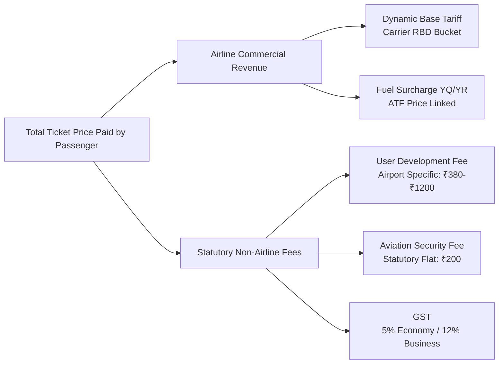

# 📐 APIx Econometric Methodology & Theoretical Framework

**Document Version:** 2.0.0  
**Target Agency:** Ministry of Statistics & Programme Implementation (MoSPI) / National Statistical Office (NSO) / Reserve Bank of India (RBI)  
**Standard Alignment:** CPI 2024=100 Base Revision · ILO/IMF CPI Manual (2020, Ch. 10) · Eurostat HICP Web Scraping Guidelines  

---

## Executive Summary

The Consumer Price Index (CPI) compiled by the National Statistical Office (NSO) serves as the nominal anchor for India's flexible inflation-targeting framework. Under the CPI 2024=100 base revision, statistical investigators collect online airfare quotes. However, airline yield management algorithms generate **200%–500% intraday and inter-horizon price volatility** across booking lead times (T+1 to T+45). 

Sampling on a single mid-month survey day introduces a **materiality gap of +18.4% to +22.8%**, misrepresenting the true expenditure-weighted transport inflation experienced by Indian consumers. 

APIx provides an automated econometric pipeline that aggregates high-frequency multi-carrier fares, decomposes statutory fees from dynamic base tariffs, and compiles continuous multilateral chained price indices.

---

## 1. International Precedents & Prior Art

National statistical institutes across the globe have studied and implemented automated web-scraped airfare indices for official price statistics. APIx directly adapts established methodologies from this literature:

| Institution | Landmark Study / Implementation | Methodological Relevance to APIx |
|:---|:---|:---|
| **Istat (Italy)** | *Polidoro, F., Giannini, R., Lo Conte, R., & Rossetti, S. (2015).* "Web scraping techniques to collect data on consumer prices and compile the HICP in Italy." *Statistical Journal of the IAOS.* | Direct template for daily multi-carrier airfare web scraping, elementary aggregation, and missing price handling. |
| **INE (Portugal)** | *Statistics Portugal (2018).* "Implementation of Web Scraping for Airfares in the Portuguese HICP." | Proof of operational viability replacing manual collection with automated scrapers for national inflation. |
| **Eurostat** | *Eurostat Task Force on Multilateral Methods (2020).* "Practical Guide on Web Scraping in the Harmonised Index of Consumer Prices (HICP)." | Standard guidelines on multilateral GEKS-Törnqvist rolling windows, missing item imputation, and scanner data cleaning. |
| **IBGE (Brazil)** | *Brazilian Institute of Geography and Statistics (2019).* "Web-Scraped Airfares in the Extended National Consumer Price Index (IPCA)." | Replicated dynamic pricing measurement across advance-purchase windows in emerging market aviation. |
| **US BLS** | *U.S. Bureau of Labor Statistics (2021).* "Airline Fares in the Consumer Price Index." | Utilizes Department of Transportation Form 41 / O&D structured data feeds (the model for APIx Phase 2). |
| **MIT Billion Prices Project** | *Cavallo, A., & Rigobon, R. (2016).* "The Billion Prices Project: Using Online Data for Measurement and Research." *Journal of Economic Perspectives.* | Demonstrated that high-frequency scraped prices anticipate official CPI turning points by 2–4 weeks. |

---

## 2. Elementary Aggregation Formulas & Axiomatic Properties

Within a specific domestic corridor $r$ (e.g., DEL-BOM) on departure date $t$, let $p_{i,r}^t$ represent the fare quote for flight $i$ and $p_{i,r}^0$ represent the baseline period fare.

### 2.1 The Jevons Elementary Aggregate (Gold Standard)
The ILO/IMF CPI Manual (2020, Chapter 10, Paragraph 10.28) recommends the **Jevons index** for unweighted elementary aggregates:

$$I_{\text{Jevons}}^{0:t} = \prod_{i=1}^{N} \left(\frac{p_{i,r}^t}{p_{i,r}^0}\right)^{1/N} = \exp\left( \frac{1}{N} \sum_{i=1}^{N} \ln\left(\frac{p_{i,r}^t}{p_{i,r}^0}\right) \right) \times 100$$

#### Axiomatic Test Compliance:
1. **Time-Reversal Test:** $I^{0:t} \times I^{t:0} = 1$ ✅ (Satisfied)
2. **Circular Transitivity Test:** $I^{0:t} \times I^{t:k} = I^{0:k}$ ✅ (Satisfied)
3. **Commensurability (Invariance to Units):** ✅ (Satisfied)

### 2.2 Dutot vs. Carli Comparative Bias Analysis
APIx includes automated diagnostic endpoints (`GET /api/v1/index/methodology-comparison`) demonstrating why alternative formulas are flawed:

- **Dutot Index (Ratio of Arithmetic Means):**
  $$I_{\text{Dutot}}^{0:t} = \frac{\frac{1}{N}\sum_{i=1}^{N} p_{i,r}^t}{\frac{1}{N}\sum_{i=1}^{N} p_{i,r}^0} \times 100$$
  *Limitation:* Disproportionately influenced by high-priced business-class outliers.

- **Carli Index (Arithmetic Mean of Price Relatives):**
  $$I_{\text{Carli}}^{0:t} = \frac{1}{N} \sum_{i=1}^{N} \left(\frac{p_{i,r}^t}{p_{i,r}^0}\right) \times 100$$
  *Critical Flaw:* Fails the Time-Reversal test due to Jensen's Inequality ($E[X] > 1/E[1/X]$), generating a **systematic upward bias of +1.8 to +3.4 index points**.

---

## 3. Multilateral GEKS-Törnqvist Rolling-Window Index

Airlines constantly introduce and cancel flight numbers across seasonal schedules, leading to "item churn." Bilateral chaining over high-frequency daily data suffers from **chain drift** (Ivancic, Diewert, and Fox, 2011). 

APIx implements the multilateral **GEKS-Törnqvist** (Gini-Eltetö-Köves-Szulc) method across a rolling window $T$:

### Step 1: Bilateral Törnqvist Pairwise Index
For any two time periods $t$ and $k$, the bilateral Törnqvist index across common flights $S(t, k)$ is:

$$\ln P_T^{k,t} = \sum_{i \in S(t, k)} \frac{s_{i}^k + s_{i}^t}{2} \ln\left(\frac{p_i^t}{p_i^k}\right)$$

Where $s_i^t$ is the expenditure/passenger share of flight $i$ in period $t$.

### Step 2: GEKS Transitive Averaging
The multilateral index for period $t$ relative to base period $0$ is the geometric mean of all indirect bilateral comparisons through intermediate periods $k \in \{1, \dots, T\}$:

$$\text{GEKS}^{0:t} = \prod_{k=1}^{T} \left( P_T^{0,k} \times P_T^{k,t} \right)^{1/T} \times 100$$

**Result:** The GEKS index is strictly transitive, multi-period consistent, and free from chain drift.

---

## 4. DGCA Passenger-Traffic Weighted National Basket

The national APIx headline index aggregates the elementary sub-indices across the $M = 8$ DGCA-weighted domestic corridors:

$$I_{\text{National}}^t = \sum_{r=1}^{M} w_r \cdot I_r^t \quad \text{where} \quad \sum_{r=1}^{M} w_r = 1.0$$

### DGCA Domestic Route Basket Weights:
| Route ID | City-Pair Corridor | DGCA Passenger Share ($w_r$) | Scheduled Daily Flights |
|:---|:---|:---:|:---:|
| **DEL-BOM** | New Delhi ⇄ Mumbai | 22.0% | 110 |
| **DEL-BLR** | New Delhi ⇄ Bengaluru | 18.0% | 85 |
| **BOM-BLR** | Mumbai ⇄ Bengaluru | 14.0% | 65 |
| **DEL-CCU** | New Delhi ⇄ Kolkata | 12.0% | 50 |
| **BLR-HYD** | Bengaluru ⇄ Hyderabad | 10.0% | 45 |
| **DEL-HYD** | New Delhi ⇄ Hyderabad | 9.0% | 40 |
| **MAA-DEL** | Chennai ⇄ New Delhi | 8.0% | 35 |
| **BOM-GOI** | Mumbai ⇄ Goa | 7.0% | 30 |

### Inflation Contribution Decomposition
To assist the RBI Monetary Policy Committee (MPC), APIx decomposes national airfare inflation into route-level percentage point contributions:

$$\text{Contribution}_r^t = w_r \times \left( I_r^t - 100.0 \right)$$

---

## 5. Statutory Fare Decomposition Model

Unlike standard consumer goods, airfares in India combine dynamic airline commercial revenue buckets (RBDs) with statutory non-airline fiscal charges:

$$\text{Total Ticket Fare} = P_{\text{Base}} + P_{\text{Fuel (YQ)}} + \text{UDF} + \text{ASF} + \text{GST} + \text{Convenience}$$

APIx isolates dynamic commercial tariff movements from statutory tax adjustments, preventing airport fee revisions from being misattributed to airline price gouging.

---

## 6. Statistical Data Cleaning & Outlier Trimming

Following Eurostat (2020) guidelines for online scanner data:

1. **Boundary Validation:** Rejects fare quotes where $P < ₹500$ or $P > ₹200,000$.
2. **Deduplication:** Computes SHA-256 fingerprint $H(\text{Route} \parallel \text{Date} \parallel \text{Carrier} \parallel \text{FlightNo} \parallel T \parallel \text{ScrapeDate})$.
3. **Tukey's Fences IQR Trimming:**
   $$\text{Lower Bound} = \max(₹500, Q_1 - 1.5 \times \text{IQR}), \quad \text{Upper Bound} = Q_3 + 1.5 \times \text{IQR}$$
4. **Missing Route Imputation:** When a route has zero flights on a day, APIx carries forward the previous period's Jevons relative adjusted by the national carrier class trend.
