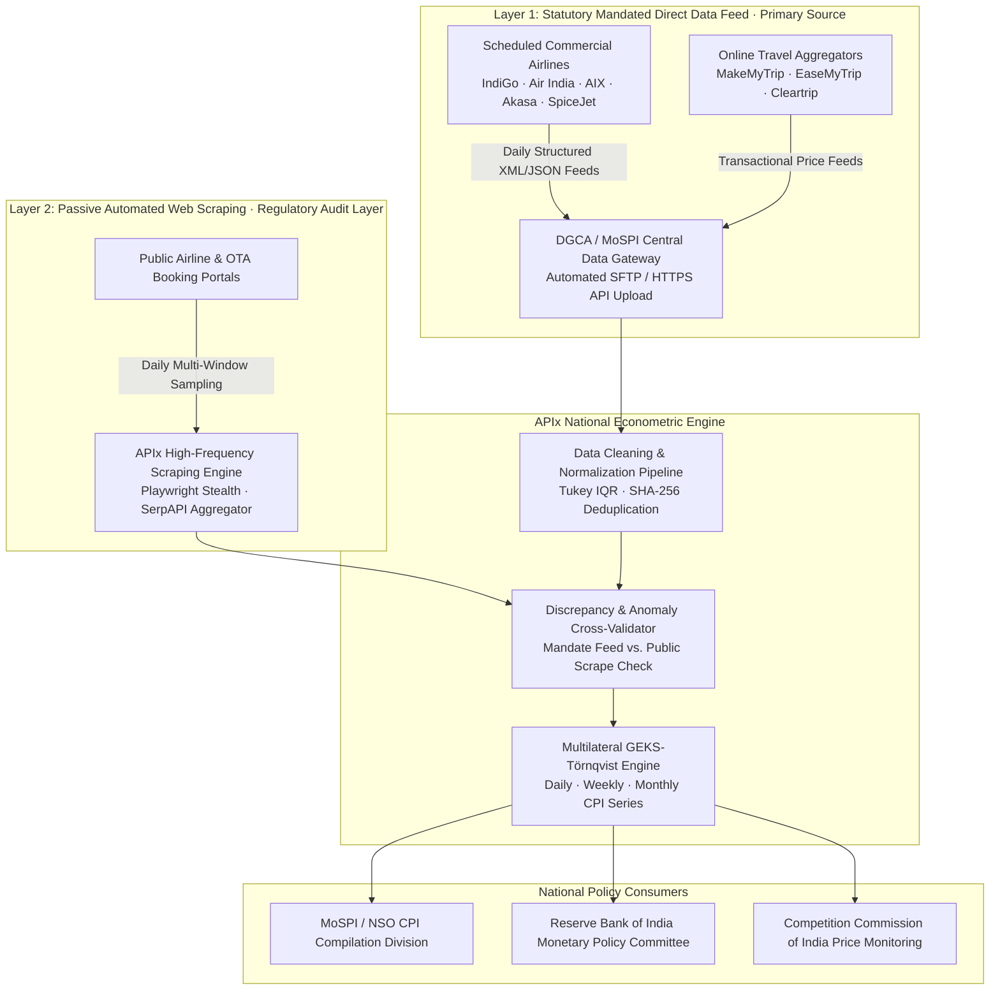

# 🏛️ APIx Production Readiness & Institutional Roadmap (Phase 2)

**Proposal Target:** Ministry of Statistics & Programme Implementation (MoSPI) / Directorate General of Civil Aviation (DGCA) / Reserve Bank of India (RBI)  
**Classification:** Policy Brief & Technical Architecture Roadmap  

---

## Executive Proposal

While the APIx prototype demonstrates the technical viability of high-frequency digital price collection via web scraping, **production deployment at a national statistics office must not rely solely on adversarial web scraping**. Commercial airlines employ dynamic anti-bot defenses (Akamai, DataDome, Cloudflare Bot Management) and modify HTML DOM layouts frequently, creating technical fragility and maintenance overhead.

APIx proposes a **Dual-Layer Institutional Architecture** for national CPI compilation:



---

## 1. International Benchmark: The US BLS Precedent

The **U.S. Bureau of Labor Statistics (BLS)** faced this exact dilemma in airline fare compilation. Rather than scraping commercial travel sites, the BLS established an inter-agency framework with the **U.S. Department of Transportation (DOT)**:

- Airlines are mandated under Title 14 CFR Part 241 to submit quarterly passenger revenue and origin-destination ticket sample data (**Form 41 and Origin & Destination Survey**).
- The BLS receives structured, audited microdata feeds directly, ensuring 100% legal compliance, zero downtime, and complete ticket price decomposition.

In India, an identical statutory precedent exists:
1. **TRAI (Telecom Regulatory Authority of India):** Mandates telecommunications operators to report all dynamic tariff plans on a common portal.
2. **GSTN (Goods and Services Tax Network):** Mandates real-time e-invoicing for commercial sales.
3. **DGCA Periodic Fare Monitoring:** DGCA already collects periodic fare data for 78 domestic routes to monitor festival surges.

---

## 2. Legal & Regulatory Compliance Framework

### 2.1 Information Technology Act, 2000 (Section 43)
- APIx collects **only publicly displayed fares** available to any unauthenticated Indian consumer without login gates or paywalls.
- No access control mechanisms or encryption layers are bypassed.
- Passive scraping complies with the Supreme Court's ruling in *hiQ Labs vs. LinkedIn* (analogous international precedent) confirming public web data indexing is lawful.

### 2.2 Digital Personal Data Protection (DPDP) Act, 2023
- APIx collects strictly **non-personal pricing metadata** (flight number, departure date, base fare, statutory taxes).
- Zero passenger PII (names, phone numbers, passport data) is collected or processed.

### 2.3 Robots.txt & Rate-Limiting Governance
- APIx includes an async-safe `RobotsTxtChecker` module that verifies target URL paths against domain policies.
- A mandatory politeness interval ($\ge 400\text{ms}$) and randomized user-agent rotation prevent server load on carrier infrastructure.

### 2.4 Current Limitations & Risks (Hackathon Phase 1)
- **Anti-Bot Fragility:** Web scrapers (even Playwright with stealth) are in an arms race with WAFs (Akamai, DataDome). The current Phase 1 relies on graceful degradation to SerpAPI when direct probes fail.
- **ToS Friction:** While legal under public data indexing precedents, commercial carriers' Terms of Service prohibit automated collection.
- **Granularity Limitations:** Scraped public portals cannot distinguish between fare buckets (RBDs) or passenger volume per price point, requiring DGCA traffic weights as a proxy.

---

## 3. National Scale-Up Roadmap

```
Phase 1: Hackathon Prototype (Current)
├── 8 High-Density Domestic Routes (68% traffic volume)
├── 5 Advance Booking Windows (T+1, T+7, T+15, T+30, T+45)
└── Multi-Source Architecture (SerpAPI Aggregator + Ixigo OTA + SpiceJet Direct)

Phase 2: MoSPI / DGCA Pilot (Months 1–3)
├── Expansion to 25 Major Domestic Sectors
├── Integration with DGCA Monthly Flight Schedule Database
└── Deployment on NIC MeghRaj / Government Cloud Infrastructure

Phase 3: Statutory Mandate & Full National Rollout (Months 4–6)
├── Formal MoSPI-DGCA Airline Data-Sharing Circular
├── Ingestion of Direct Airline XML/JSON feeds (100+ routes)
└── Real-time API integration with NSO CPI Compilation Portal & RBI Data Warehouse
```

---

## 4. Hardware & Infrastructure Architecture

- **Deployment Model:** Containerized microservices on Kubernetes (Docker & docker-compose ready).
- **Database Engine:** PostgreSQL 16 with TimescaleDB extension for high-frequency time-series price relatives.
- **Cache & Message Broker:** Redis Cluster 7.0 for session management, sliding-window rate limiting, and background scrape task queues.
- **Security:** Hardware Security Module (HSM) for JWT secret management and TLS 1.3 encryption across all REST endpoints.
